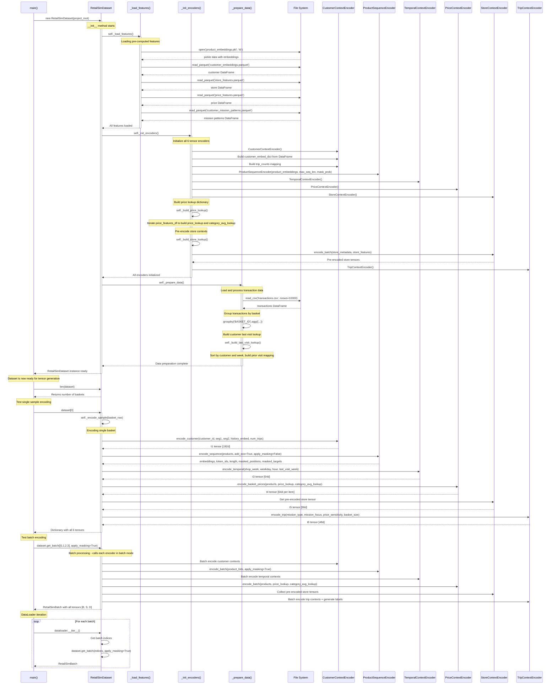

# Tensor Preparation Sequence Diagram

## Overview
This document shows the detailed sequence of operations for tensor preparation in RetailSim, starting from line 269 in the main function of `run_tensor_preparation.py`.

## Sequence Diagram

## Key Details of the Tensor Preparation Process

### 1. **Feature Loading Phase** (`_load_features`)
- Loads 5 pre-computed feature files from `data/features/`
- **Product embeddings**: 256d per product from Layer 3 graph embeddings
- **Customer embeddings**: 160d per customer from Layer 4 history encoding
- **Store features**: 96d per store from Layer 5 context encoding
- **Price features**: 64d per price observation from Layer 2 Fourier encoding
- **Mission patterns**: Customer trip patterns from Stage 4 data pipeline

### 2. **Encoder Initialization** (`_init_encoders`)
- Creates 6 encoder instances for T1-T6 tensors
- **T1 - CustomerContextEncoder**: Combines segments, history, and affinity
- **T2 - ProductSequenceEncoder**: Handles product sequences with masking
- **T3 - TemporalContextEncoder**: Encodes time patterns and visit frequency
- **T4 - PriceContextEncoder**: Processes price features per item
- **T5 - StoreContextEncoder**: Pre-encodes all store contexts for efficiency
- **T6 - TripContextEncoder**: Encodes mission types and generates labels

### 3. **Data Preparation** (`_prepare_data`)
- Loads raw transactions (limited to 10,000 rows by default for testing)
- Groups by `BASKET_ID` to create shopping trips
- Builds customer visit history for temporal features
- Creates basket-level aggregations for trip context

### 4. **Tensor Generation Process**

#### **Single Sample Encoding** (`dataset[0]`)
- **T1 (Customer Context)**: 192d = segments(32) + history(160) + affinity(0)
- **T2 (Product Sequence)**: 256d per item from pre-trained embeddings
- **T3 (Temporal Context)**: 64d = week(32) + weekday(16) + hour(16)
- **T4 (Price Context)**: 64d per item = fourier(32) + log(8) + relative(16) + velocity(8)
- **T5 (Store Context)**: 96d = format(32) + region(32) + operational(32) + identity(0)
- **T6 (Trip Context)**: 48d = mission_type(16) + mission_focus(16) + price_sensitivity(8) + basket_size(8)

#### **Batch Processing** (`dataset.get_batch()`)
- Processes multiple baskets simultaneously
- Applies BERT-style masking to product sequences when requested
- Generates auxiliary labels for trip prediction tasks
- Returns `RetailSimBatch` object with:
  - Dense context: [B, 400] (concatenated T1+T3+T5+T6)
  - Sequence features: [B, S, 320] (concatenated T2+T4)
  - Attention masks and sequence lengths
  - Trip labels for supervised learning

### 5. **DataLoader Integration**
- Provides batched iteration over the dataset
- Supports shuffling and masking for training
- Handles variable-length sequences with padding
- Generates training-ready tensors for model consumption

## Memory and Performance Considerations

### **Memory Optimization**
- Pre-encoding store contexts avoids repeated computation
- Lazy loading of features only when needed
- Efficient data structures (dictionaries for lookups)

### **Performance Features**
- Batch processing for GPU utilization
- Vectorized operations within encoders
- Attention mechanisms for sequence handling
- Masking strategy for self-supervised learning

## Output Tensors Summary

| Tensor | Dimension | Type | Description |
|--------|-----------|------|-------------|
| T1 | 192d | Dense | Customer context per transaction |
| T2 | 256d/item | Sequence | Product embeddings per basket item |
| T3 | 64d | Dense | Temporal context per transaction |
| T4 | 64d/item | Sequence | Price features per basket item |
| T5 | 96d | Dense | Store context per transaction |
| T6 | 48d | Dense | Trip context per transaction |

**Total Dense Context**: 400d per transaction  
**Total Sequence Features**: 320d per basket item

This tensor preparation pipeline efficiently combines all feature engineering outputs into model-ready tensors for the RetailSim world model.
